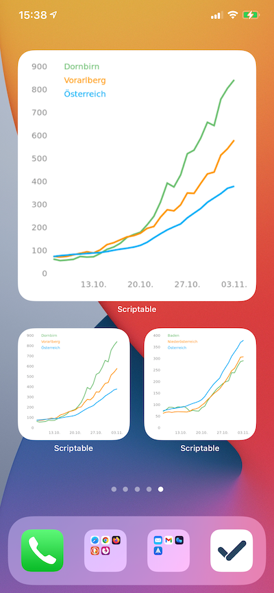
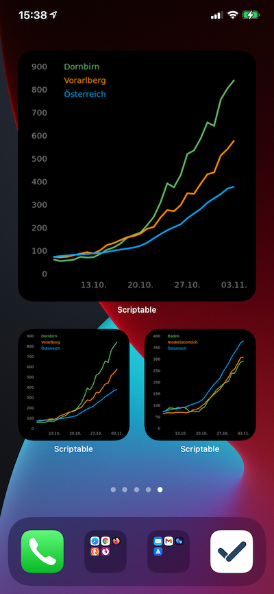

# Austria-7-day-incidents-widget
Das Widget kann mit iOS 14 und der [Scriptable App](https://scriptable.app) (kostenlos) verwendet werden.

Es werden drei Verläufe der 7-Tages-Inzidenz angezeigt: Bezirk, Bundesland und Österreich. Bezirk und Bundesland können über einen Parameter gesteuert werden.

  

## Idee
Auf die Idee kamen wir durch das [geniale Widget](https://gist.github.com/marco79cgn/23ce08fd8711ee893a3be12d4543f2d2), das anzeigt, wie viel Klopapier im nächsten DM verfügbar ist. Es gibt auch ein [schönes Widget](https://gist.github.com/kevinkub/46caebfebc7e26be63403a7f0587f664), das Werte für Deutschland angibt, allerdings leider nicht für Österreich. Außerdem war uns der Verlauf über die letzten 4 Wochen wichtig, damit wir hoffentlich bald die Auswirkungen des zweiten Lockdowns sehen können.

## Installation 
* Kopiere den Source code von [hier](austria-incidents.js) (klick vorher auf "raw" oben rechts)
* Öffne die Scriptable app
* Klick auf das "+" Symbol oben rechts und füge das kopierte Skript ein
* Klick auf den Titel des Skripts ganz oben und vergebe einen Namen (z.B. Inzidenzen)
* Speichere das Skript durch Klick auf "Done" oben links
* Gehe auf deinen iOS Homescreen und drücke irgendwo lang, um in den "wiggle mode" zu kommen (mit dem man auch die App Symbole anordnen kann)
* Drücke das "+" Symbol oben links, blättere dann nach unten zu "Scriptable" (Liste ist alphabetisch), wähle als Widget Größe entweder small oder large und drück unten auf "Widget hinzufügen"
* Drücke auf das Widget, um seine Einstellungen zu bearbeiten (optional lang drücken, wenn der Wiggle Modus schon beendet wurde)
* Wähle unter "Script" das oben erstellte aus (Inzidenz)
* Gib als "Parameter" den gewünschten Bezirk und Bundesland an, Format bspw. `803;8` für Bezirk Dornbirn, Bundesland Vorarlberg (Standard).

## Bundesländer
```
1. Burgenland
2. Kärnten
3. Niederösterreich
4. Oberösterreich
5. Salzburg
6. Steiermark
7. Tirol
8. Vorarlberg
9. Wien
```

## Bezirke
```
101. Eisenstadt(Stadt)
102. Rust(Stadt)
103. Eisenstadt-Umgebung
104. Güssing
105. Jennersdorf
106. Mattersburg
107. Neusiedl am See
108. Oberpullendorf
109. Oberwart
201. Klagenfurt Stadt
202. Villach Stadt
203. Hermagor
204. Klagenfurt Land
205. Sankt Veit an der Glan
206. Spittal an der Drau
207. Villach Land
208. Völkermarkt
209. Wolfsberg
210. Feldkirchen
301. Krems an der Donau(Stadt)
302. Sankt Pölten(Stadt)
303. Waidhofen an der Ybbs(Stadt)
304. Wiener Neustadt(Stadt)
305. Amstetten
306. Baden
307. Bruck an der Leitha
308. Gänserndorf
309. Gmünd
310. Hollabrunn
311. Horn
312. Korneuburg
313. Krems(Land)
314. Lilienfeld
315. Melk
316. Mistelbach
317. Mödling
318. Neunkirchen
319. Sankt Pölten(Land)
320. Scheibbs
321. Tulln
322. Waidhofen an der Thaya
323. Wiener Neustadt(Land)
325. Zwettl
401. Linz(Stadt)
402. Steyr(Stadt)
403. Wels(Stadt)
404. Braunau am Inn
405. Eferding
406. Freistadt
407. Gmunden
408. Grieskirchen
409. Kirchdorf an der Krems
410. Linz-Land
411. Perg
412. Ried im Innkreis
413. Rohrbach
414. Schärding
415. Steyr-Land
416. Urfahr-Umgebung
417. Vöcklabruck
418. Wels-Land
501. Salzburg(Stadt)
502. Hallein
503. Salzburg-Umgebung
504. Sankt Johann im Pongau
505. Tamsweg
506. Zell am See
601. Graz(Stadt)
603. Deutschlandsberg
606. Graz-Umgebung
610. Leibnitz
611. Leoben
612. Liezen
614. Murau
616. Voitsberg
617. Weiz
620. Murtal
621. Bruck-Mürzzuschlag
622. Hartberg-Fürstenfeld
623. Südoststeiermark
701. Innsbruck-Stadt
702. Imst
703. Innsbruck-Land
704. Kitzbühel
705. Kufstein
706. Landeck
707. Lienz
708. Reutte
709. Schwaz
801. Bludenz
802. Bregenz
803. Dornbirn
804. Feldkirch
900. Wien
```